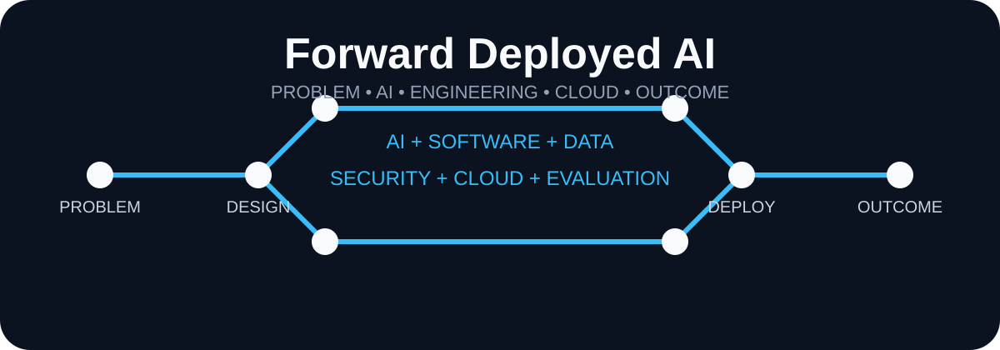
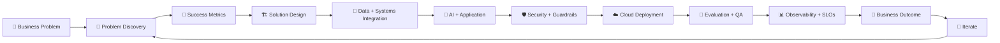
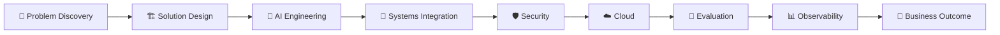

# 🚀 Forward Deployed AI Engineer

<div align="center">



<br/>

<strong>From real-world problem → production AI solution</strong>

<br/><br/>

<a href="https://github.com/amitweb2012/forward-deployed-ai-engineer/stargazers"></a>
<a href="https://github.com/amitweb2012/forward-deployed-ai-engineer/network/members"></a>
<a href="https://github.com/amitweb2012/forward-deployed-ai-engineer/blob/main/LICENSE"></a>


</div>

> **Problem First → Technology Second → Business Outcome Always**

A portfolio-focused engineering lab for turning ambiguous business and customer problems into practical, secure, measurable, production-ready AI solutions.

**Problem Discovery • Solution Design • AI Engineering • Integration • Security • Cloud • Evaluation • Observability**

---

## 🧭 What Is This Repository?

This repository is designed around the **Forward Deployed AI Engineer (FDE)** mindset: understand the real customer problem, work with existing systems and data, build the right AI/software solution, deploy it safely, measure it, and continuously improve it.

It combines:

```text
Business Problem
      ↓
Problem Discovery
      ↓
Success Metrics
      ↓
Solution Design
      ↓
AI + Software + Data Integration
      ↓
Application Layer
      ↓
Security + Guardrails
      ↓
Cloud Deployment
      ↓
Evaluation + QA
      ↓
Observability + Cost + SLOs
      ↓
Customer Outcome
      ↓
Iterate
```

---

## 🏗️ FDE Lifecycle



### The FDE mindset

| Principle | Meaning |
|---|---|
| 🎯 **Start with the problem** | Understand users, workflows, constraints and business impact |
| 🧩 **Integrate with reality** | Work with existing APIs, databases, identity, SaaS and operational systems |
| 🤖 **Use AI where it helps** | Apply LLMs, RAG, agents and automation where they create measurable value |
| 🛡️ **Design for trust** | Security, authorization, guardrails, evaluation and human escalation |
| 📊 **Measure outcomes** | Quality, latency, cost, reliability, adoption and business KPIs |

---

## 🧰 Engineering Stack

### 💻 Application Engineering

<p>


</p>

### 🧠 AI / GenAI

<p>


</p>

**Models & platforms:** OpenAI • Claude • Gemini • Hugging Face

### 🗄️ Data & Messaging

<p>


</p>

### 🔐 Security & Identity

OAuth2 • OIDC • JWT • RBAC • IAM • API Gateway • mTLS • Keycloak

### ☁️ Cloud & Platform

<p>


</p>

**CI/CD:** GitLab CI • Jenkins • Argo CD

### 📊 Observability

Prometheus • Grafana • Splunk • Elastic APM

---

# 🧪 Portfolio Projects

Each project is intended to demonstrate an end-to-end FDE workflow, not just an isolated model or API.

## 01 · 🧠 Enterprise AI Knowledge Assistant

```text
Enterprise Documents + APIs
          ↓
       Ingestion
          ↓
     Chunk / Embed
          ↓
    Vector Retrieval
          ↓
          RAG
          ↓
         LLM
          ↓
   Secure AI API
          ↓
 Evaluation + Deployment
```

**Focus:** enterprise knowledge, grounded answers, integrations, security, evaluation and production delivery.

---

## 02 · 🤝 Customer Support AI Agent

```text
Customer Request
      ↓
Intent / Context
      ↓
AI Agent
      ↓
Enterprise Tools / APIs
      ↓
Response
      ↓
Human Escalation
```

**Focus:** tool use, workflow automation, controlled actions and human-in-the-loop support.

---

## 03 · 📄 Document Intelligence Platform

```text
Documents
   ↓
Extraction
   ↓
Classification
   ↓
Structured Output
   ↓
Validation
   ↓
Enterprise API
```

**Focus:** document processing, extraction quality, structured outputs and downstream system integration.

---

## 04 · ⚙️ Operations Copilot

```text
Operational Data + APIs
          ↓
      AI Assistant
          ↓
   Authorized Actions
          ↓
      Audit Trail
          ↓
   Human / System Outcome
```

**Focus:** operational workflows, permissions, action safety, traceability and business impact.

---

## 📈 Portfolio Standard

Every project follows the same engineering story:

```text
Problem
  ↓
Constraints
  ↓
Architecture
  ↓
Implementation
  ↓
Evaluation
  ↓
Deployment
  ↓
Observability
  ↓
Outcome
```

### ✅ What a strong project should answer

| Question | What to demonstrate |
|---|---|
| 🎯 **What problem?** | User pain, workflow and business context |
| 🧠 **Why AI?** | Why LLM/ML is better than a conventional solution |
| 🏗️ **How built?** | Architecture, APIs, data flow and implementation |
| 🔐 **How secured?** | Identity, authorization, secrets, guardrails |
| 🧪 **How evaluated?** | Quality, groundedness, safety, regression and human review |
| ☁️ **How deployed?** | Cloud, containers, Kubernetes and CI/CD |
| 📊 **How operated?** | Logs, traces, metrics, SLOs and cost |
| 💼 **What changed?** | User experience and measurable business outcome |

---

## 🔗 Related Portfolio

### 🧠 Machine Learning Lab

**Statistics → EDA → Preprocessing → ML → Evaluation → MLOps → Deployment**

👉 https://github.com/amitweb2012/machine-learning-lab

### 🤖 AI Agent

**LLM → Tools → RAG → MCP → Agent Orchestration**

👉 https://github.com/amitweb2012/ai-agent

### 🚀 This Repository

**Problem → Integrate → Build → Secure → Deploy → Evaluate → Operate → Improve**

---

## 🎤 Interview Story

A strong FDE project should tell this story:

```text
What was the problem?
        ↓
Who experienced it?
        ↓
What systems and data existed?
        ↓
Why was AI useful?
        ↓
How was the solution integrated?
        ↓
How was it secured?
        ↓
How was quality evaluated?
        ↓
How was it deployed?
        ↓
How was it monitored?
        ↓
What changed for the customer/business?
```

> 💡 **The goal is not “I built an LLM application.”**
>
> The goal is **“I solved a real problem with AI, software engineering, systems integration and measurable outcomes.”**

---

## 🗺️ FDE Learning Path



---

## 👤 Author

<div align="center">

### Amit Das

**Software Engineer | AI Engineer | Forward Deployed AI Engineer**

Building at the intersection of:

**AI + Software Engineering + Cloud + Security + Data + Customer Outcomes**

</div>

---

## 📄 License

MIT

<div align="center">
  <sub>Built for practical AI engineering, customer-focused delivery, and production-oriented systems.</sub>
</div>
